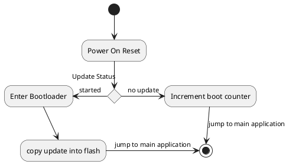

# coneRGB STM32 Bootloader

To facilitate over the air updates, coneRGB implements a custom bootloader.

## Over The Air Update Procedure

* Initiate a firmware update over a supported transport (BLE, CAN)
* Write the entire update binary
* Initiate a reset
* The bootloader will now copy the update payload into flash
