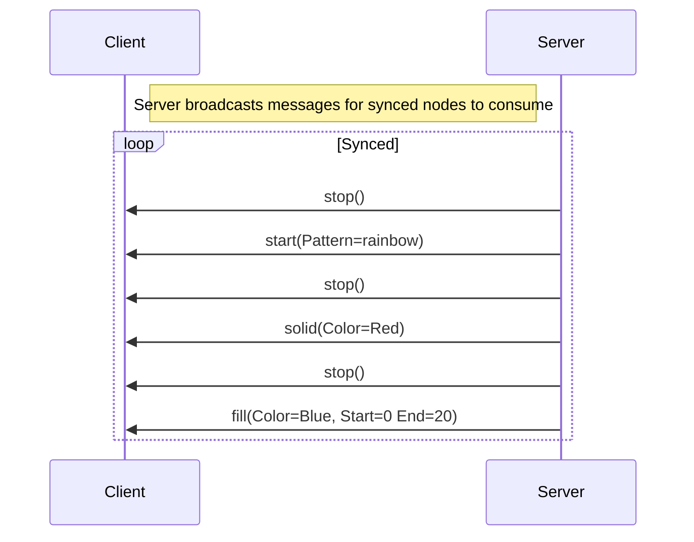

# RGB Wireless Sync Protocol

## Glossary

|term|description|
|-|-|
|Node| Single installation of a device. Has the role of `Server` or `Client`|
|Server| leader node. Clients will "sync" with this node |
|Client| follower node. Accepts broadcasted messages from a Server|
|Network| channel for nodes to communicate over. Nodes identify a network by a 16 byte identifier which is also used to encrypt traffic.

## Networked Node Roles

Every network may have **AT MOST** exactly one `Server`. A `Server` may not be available when joining a network. This
is considered a valid state, if no `Server` is available, a `Client` may **not** claim the `Server` role. The `Client` should create a new network.

## Joining or Creating a network

`Network`s are identified by a 16 byte unique identifier. When created, a new `Network`'s identifier should be reasonably random, while also being easily exchangable. Consider a 4 byte random id, and (up to) 12 bytes for a password.
A `Node` on a `Network` with matching 4 byte ID, but incorrect password is fundementally a different, but valid `Network`.

## BLE Configuration

Devices must be configured with a single configuration value
of up to 66 bytes for the network ID. Below describes the
BLE configuration

|Characteristic|Description|Access|UUID|
|-|-|-|-|
|Network ID|up to 66 bytes of network identification|Read/Write|2ef0029c-162d-46f7-95a2-d293be395bb0|
|Role|server, client or inactive|read/write|15fd3aea-e732-4e19-9a60-491f172226fd|
|Status|connection status + RSSI |read|99dd56ee-586a-419d-bbd8-2f38fb2627af|
|Node ID|[unused] node id|read|97540ab3-af29-4231-b3e3-a5b589133641|
|pass-thru|[debug]used to pass packets through via BLE|notification|20bd3a60-3245-4488-8544-8f8c3b337f50|
